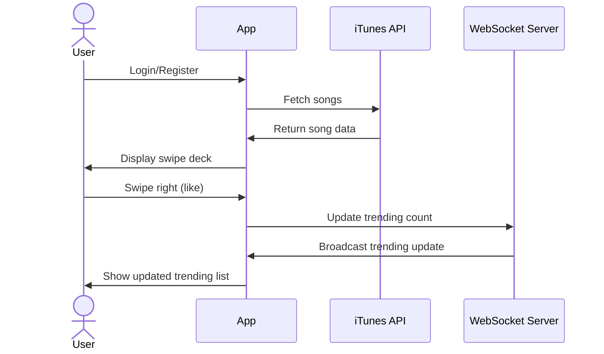

# SongSwipe

[My Notes](notes.md)

A brief description of the application here. 

> [!NOTE]
>  This is a template for your startup application. You must modify this `README.md` file for each phase of your development. You only need to fill in the section for each deliverable when that deliverable is submitted in Canvas. Without completing the section for a deliverable, the TA will not know what to look for when grading your submission. Feel free to add additional information to each deliverable description, but make sure you at least have the list of rubric items and a description of what you did for each item.

> [!NOTE]
>  If you are not familiar with Markdown then you should review the [documentation](https://docs.github.com/en/get-started/writing-on-github/getting-started-with-writing-and-formatting-on-github/basic-writing-and-formatting-syntax) before continuing.

## 🚀 Specification Deliverable

> [!NOTE]
>  Fill in this sections as the submission artifact for this deliverable. You can refer to this [example](https://github.com/webprogramming260/startup-example/blob/main/README.md) for inspiration.

For this deliverable I did the following. I checked the box `[x]` and added a description for things I completed.

- [ ] Proper use of Markdown
- [ ] A concise and compelling elevator pitch
- [ ] Description of key features
- [ ] Description of how you will use each technology
- [ ] One or more rough sketches of your application. Images must be embedded in this file using Markdown image references.

### Elevator pitch

SongSwipe is is a Tinder-style web app where users swipe through songs from a public music API, save the ones they like, and see trending tracks update in real time.

### Design

The application consists of four main views: a login/registration page, the main swipe interface, a trending songs page, and a personal playlist view. Users will start by creating an account or logging in, then be taken to the swipe deck where they can discover new music by swiping through song cards. Each card displays album art, song title, and plays a ten second snippet fetched from the iTunes Search API. Users can swipe right to save songs to their personal playlist or swipe left to skip. A real-time trending section shows which songs are popular across all users.

### Key features

- **Swipe Interface**: Swipe right to save a song, swipe left to skip.
- **Personal Playlist**: Your liked songs are saved to your profile.
- **Real-Time Trending**: Watch which tracks are trending live across users via WebSockets.
- **Third-Party Music API**: Songs and metadata (title, artist, album art) fetched from the iTunes Search API.
- **Authentication**: Register, login, and logout to personalize your experience.

### Technologies

I am going to use the required technologies in the following ways.

### HTML
- Use semantic HTML to structure three main views: login/register, swipe deck, and saved playlist.
- Provide accessible buttons and labels so it works well on different devices
  
### CSS
- Responsive mobile-first design.
- Smooth swipe animations and card transitions.
- Color scheme inspired by modern music apps.

### React
- Componentized UI:
  - `LoginForm` (register/login)
  - `SwipeDeck` (the stack of song cards)
  - `Playlist` (list of saved songs)
  - `Trending` (real-time trending list)
- React Router to navigate between login, swipe deck, and playlist.

### Backend Service (Node/Express)
- **Endpoints**:
  - `POST /register` – Create new user
  - `POST /login` – Authenticate user
  - `GET /songs` – Fetch songs from third-party API and deliver to client
  - `POST /like` – Save a liked song for a user
  - `GET /playlist` – Retrieve user’s saved songs
- Calls out to iTunes Search API
- Secure token-based authentication

### Database
- Store:
  - User credentials (hashed passwords)
  - User’s liked songs (song ID, title, artist, album art URL)
- Hosted on AWS.

### WebSocket
- Push real-time trending data to all connected clients:
  - When a user swipes right, increment trending count for that song.
  - Broadcast updated trending list to all clients instantly.

## 🚀 AWS deliverable

For this deliverable I did the following. I checked the box `[x]` and added a description for things I completed.

- [ ] **Server deployed and accessible with custom domain name** - [My server link](https://yourdomainnamehere.click).

## 🚀 HTML deliverable

For this deliverable I did the following. I checked the box `[x]` and added a description for things I completed.

- [x] **HTML pages** - Four HTML pages: index.html (login), deck.html (swipe interface), playlist.html (saved songs), and trending.html (trending songs).
- [x] **Proper HTML element usage** - Used semantic HTML with proper head, body, nav, form, and content structure across all pages.
- [x] **Links** - Navigation buttons link between all four pages (Home/Swipe Deck, My Playlist, Trending). GitHub repository link included in footer of relevant pages.
- [x] **Text** - Song titles, artist names, usernames, and page headings display text content throughout the application.
- [x] **3rd party API placeholder** - Album artwork images serve as placeholders for future iTunes Search API integration. The deck page displays album art that will eventually be fetched from the API.
- [x] **Images** - Album cover images displayed on deck.html, playlist.html, and trending.html (Abbey Road and Dark Side of the Moon covers).
- [x] **Login placeholder** - Login form on index.html with username and password input fields, login button, and sign-up link.
- [x] **DB data placeholder** - Playlist and trending pages display hardcoded song lists (Come Together, Money) that will eventually be stored in and retrieved from the database.
- [x] **WebSocket placeholder** - Trending page structure is in place to display real-time trending songs that will be updated via WebSocket connections.

## 🚀 CSS deliverable

For this deliverable I did the following. I checked the box `[x]` and added a description for things I completed.

- [x] **Header, footer, and main content body** - I created a top navigation bar with styled buttons, a flexible main content area that adapts to screen size, and a footer with a blurred background and text.
- [x] **Navigation elements** - I added navigation buttons that change appearance on hover and scale nicely for smaller screens.
- [x] **Responsive to window resizing** - I used media queries to adjust the size of album art, font sizes, buttons, and layout for screens smaller than 768px.
- [x] **Application elements** - I implemented album containers, song information boxes, and control buttons with hover and active effects.
- [x] **Application text content** - I styled song titles, artist names, section headers, and user information with custom fonts, gradients, and spacing.
- [x] **Application images** - I included album art and song thumbnails with borders, shadows, and responsive sizing.

## 🚀 React part 1: Routing deliverable

For this deliverable I did the following. I checked the box `[x]` and added a description for things I completed.

- [x] **Bundled using Vite** - Installed and configured Vite with npm scripts for dev, build, and preview. Created proper directory structure with public/ for assets and src/ for React code.
- [x] **Components** - Converted all HTML pages (login, play, scores, about) into React functional components. Moved CSS files into respective component directories and imported them. Created App component with header and footer.
- [x] **Router** - Implemented React Router with BrowserRouter, Routes, and NavLink components. Configured routes for all four views (/, /play, /scores, /about) with a 404 NotFound handler for invalid paths.

## 🚀 React part 2: Reactivity deliverable

For this deliverable I did the following. I checked the box `[x]` and added a description for things I completed.

- [ ] **All functionality implemented or mocked out** - I did not complete this part of the deliverable.
- [ ] **Hooks** - I did not complete this part of the deliverable.

## 🚀 Service deliverable

For this deliverable I did the following. I checked the box `[x]` and added a description for things I completed.

- [ ] **Node.js/Express HTTP service** - I did not complete this part of the deliverable.
- [ ] **Static middleware for frontend** - I did not complete this part of the deliverable.
- [ ] **Calls to third party endpoints** - I did not complete this part of the deliverable.
- [ ] **Backend service endpoints** - I did not complete this part of the deliverable.
- [ ] **Frontend calls service endpoints** - I did not complete this part of the deliverable.
- [ ] **Supports registration, login, logout, and restricted endpoint** - I did not complete this part of the deliverable.

## 🚀 DB deliverable

For this deliverable I did the following. I checked the box `[x]` and added a description for things I completed.

- [ ] **Stores data in MongoDB** - I did not complete this part of the deliverable.
- [ ] **Stores credentials in MongoDB** - I did not complete this part of the deliverable.

## 🚀 WebSocket deliverable

For this deliverable I did the following. I checked the box `[x]` and added a description for things I completed.

- [ ] **Backend listens for WebSocket connection** - I did not complete this part of the deliverable.
- [ ] **Frontend makes WebSocket connection** - I did not complete this part of the deliverable.
- [ ] **Data sent over WebSocket connection** - I did not complete this part of the deliverable.
- [ ] **WebSocket data displayed** - I did not complete this part of the deliverable.
- [ ] **Application is fully functional** - I did not complete this part of the deliverable.
